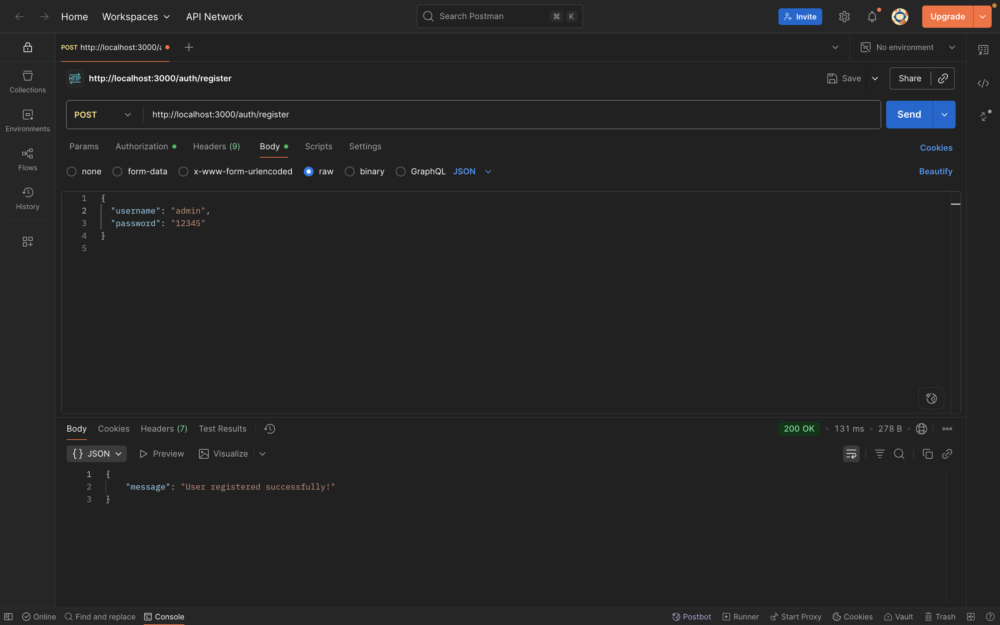
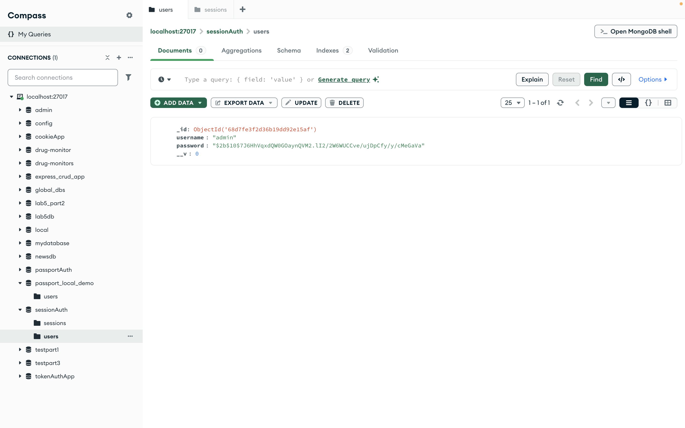
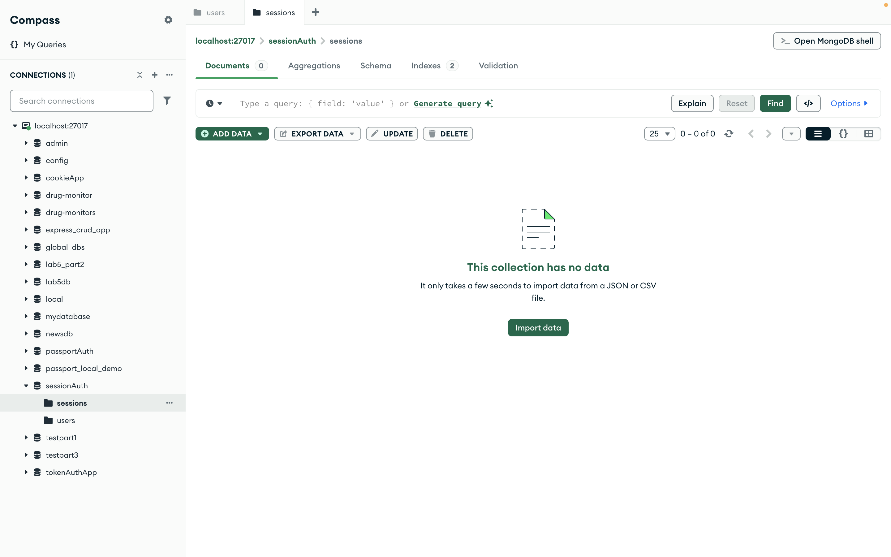
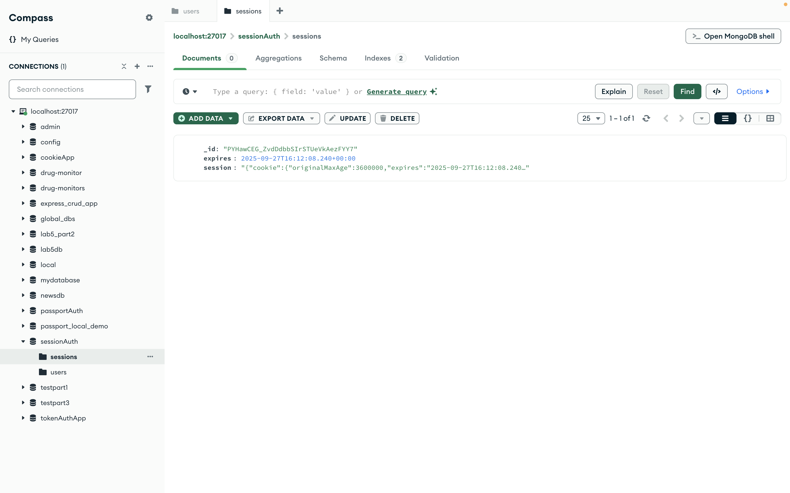
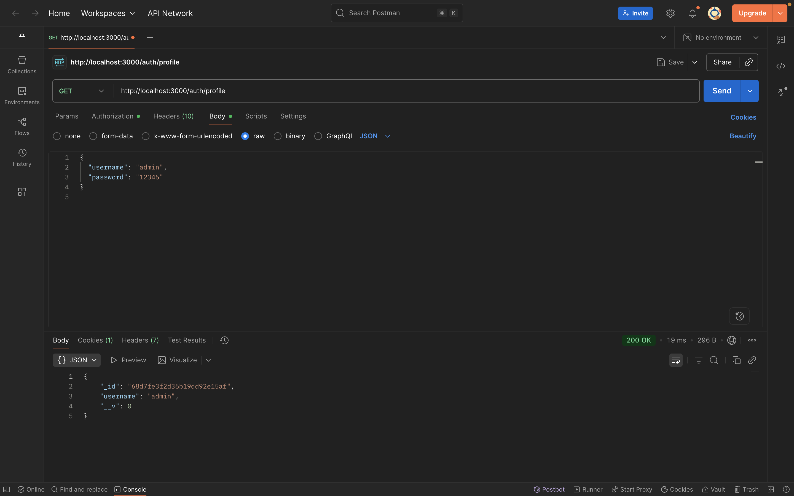
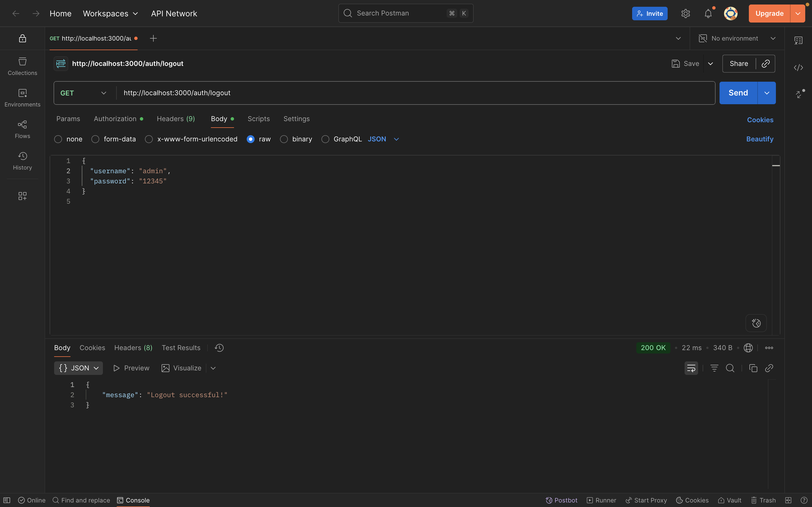
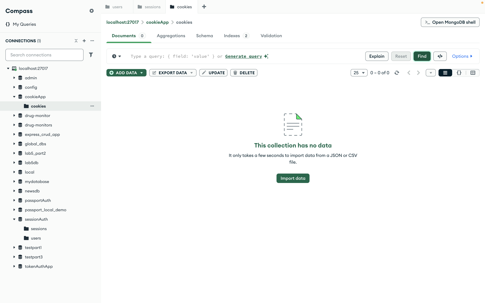

## 🚀 Cách chạy project

Cài đặt dependencies:
```bash
npm install
```

Chạy project:
```bash
npm start
```

---

## 2. cookie_session_auth source code
### a. 
Chạy:
```bash
node cookie_auth.js
```
### b. register
Kết quả:  





---

### c. login
Kết quả:  



---

### d. go to profile
Kết quả:  


--- 

### e. go to logout and check cookie is deleted in database
Kết quả:  



